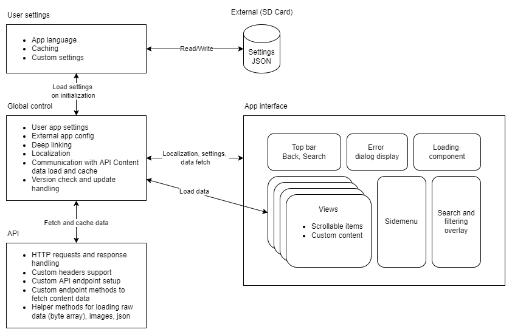

# Unity Mobile Toolkit 1.0
Written and curated by Janez Krnc (github@janezk7), 25.02.2022

## Features Summary:
- Mobile app template for Android/iOS devices
- API reposotory for fetching and handling data
- User settings management
- Support for app config from external source
- Navigation by views
- Responsive design with safe area configuration for both platforms
- Interaction UX feedback and animations 
- Item list population and scrolling
- Sliding sidemenu overlay
- Search and filtering overlay
- Dialog alert window system
- Multilanguage support
- Deeplinking functionality
- Optional: Gltf viewer and manipulation
- Optional: AR gltf model placing

## App Scenes:
- MainApp Scene: Main app interface for navigating views, browsing item lists, searching, filtering and changing settings
- AR Scene: Interface for viewing 3d model and positioning in AR space

## Building and running

1. Unity packages

Required Unity packages:
- TextMeshPRO
- Localization (com.unity.localization)
- LeanTween (https://assetstore.unity.com/packages/tools/animation/leantween-3595)
- Unity UI Extensions (https://assetstore.unity.com/publishers/49267)
    - Used for ScrollViewManager (pagination, snapping)
- (Optional) glTFast (https://github.com/atteneder/glTFast)

2. Project settings

- (**important**) Script execution: API < GlobalControl < Default Time
- (**important**) Player -> Write Permission: External (SDCard)
- Resolution and Presentation -> Disable "Start in fullscreen mode", "Optimized Frame Pacing", "Render outside safe area"
- Resolution and Presentation -> Default Orientation: Portrait

3. Build settings
- Add scenes to build
- Android settings:
    - Switch to Android platform
    - Player -> Auto Graphics API, API level 24 minimum (recommended)
    - Player -> Scripting Backend: IL2CPP (production), Mono (development)
    - Player -> Target architectures: ARMv7 and ARM64 (IL2CPP only. Better compatibility for newer phones)
- iOS settings:
    - Switch to iOS platform
    - Resolution and Presentation -> Default orientation: Portrait (recommended)
    - Resolution and Presentation -> Disable "Requires Fullscreen" and "Status Bar Hidden" (recommended)
    - Player -> Target Device: iPhone + iPad
    - Player -> Target SDK: Device SDK
    - Player -> Target minimum iOS Version: 11.0 (recommended)

---------

# App Architecture and Configuration



## App interface
`InterfaceInteraction` script contains a list of registered views and takes care of navigation and initialization between views. It also contains secondary components:
- Animated loading spinner, 
- Sliding sidemenu, 
- Error dialog with text and buttons, 
- Search and filter overlay 
- Top bar with back button, search button and a button to open sidemenu

## API repository
`API` script contains code for handling http requests and responses from server. Developer should update this class with needed api endpoint calls to fetch needed data for the app. The class contains helper methods for easy fetch of common response data types: 
- Json file
- Image (texture)
- Raw data (byte array)

### Adding a custom endpoint request method
A request method should generally call a `GetHttpResponse(string endpoint)` coroutine with a desired endpoint. It returns a `HttpResponse` object with following fields:
``` csharp
public string JsonText;
public Texture2D Texture;
public byte[] RawData;
public bool IsSuccessful;
public string HttpError;
```
Each endpoint request should return an object of `ApiResponse` class, which contains data, error message and Ok status.
``` csharp
public class ApiResponse
{
    public object Data;
    public string ErrorMessage;
    public bool Ok { get { return ErrorMessage == null; } }
}
```

`Data` field should then be casted to an expected data type if request was successful.

Json request example:

``` csharp
public IEnumerator GetCategoryList()
{
    // Send request
    var endpoint = string.Format("{0}/{1}", "http://sampleApiDomain.com", "categories");
    var cd = new CoroutineWithData(this, GetHttpResponse(endpoint));
    yield return cd.coroutine;

    // Handle response
    var response = cd.result as HttpResponse;
    if (!response.IsSuccessful)
    {
        yield return new ApiResponse() { ErrorMessage = response.HttpError };
        yield break;
    }

    // Deserialize JSON text and return
    CategoryWrapper categories = JsonUtility.FromJson<CategoryWrapper>(response.JsonText);

    yield return new ApiResponse() { Data = categories.categories };
}

```

## GlobalControl
`GlobalControl` initializes app, holds localization data and performs calls to load and cache data from the API repository. 

On initialization:
- Checks internet availability and displays error if `RequireInternetConnection` field is enabled. 
- `UserSettings` are imported and applied. if no settings exist, `DefaultSettings` are used.
- Checks app version and displays mandatory update screen if `UseExternalAppConfig` is enabled.
- Sets endpoint for API calls if `UseExternalAppConfig` is enabled. 
- Registers deep link handling

> Add implementation to handle any custom external app config fields

> Add implementation for deep link functionality in `OnDeepLinkActivated(string url)` method.

## User settings
`UserSettings` object is deserialized from a json saved on the device on app initialization. If no setting json file is found, it uses default settings. `UserSettings` can be extended to include more fields as per app needs. Currently, the class includes following fields and properties:

``` csharp
public bool IsFirstTime = true;
public int LocaleIndex;
public bool IsCacheImages = true;
public bool ShowVerboseMessages = true;
```

Core methods:
- `SaveSettings()`: Call to save and write settings to an external location on the device
- `ClearSettings()`: Deletes a settings file from external location
- `ApplySettings()`: Call after settings loading or changing settings to apply settings. 
> Add implementation for any added settings

Saved user settings are automatically imported when `GlobalControl` initializes.

## App Configuration File
The template supports a feature to load an external config file on startup. Config file contains version metadata, mandatory version, redirects to app store pages and optional API endpoint url:
``` json
{
    "apiEndpoint": "https://www.sampleapi.com",
    "latestVersion": "1.7",
    "latestMandatoryVersion": "1.7",
    "androidAppUrl": "https://play.google.com/store/apps/details?id=com.YourCompany.XXXXXXXXXX",
    "iosAppUrl": "https://apps.apple.com/us/app/xxxxxxxxx/idxxxxxxxxxx"
}
```

Fields:
- `apiEndpoint`: Required field.  for api fetch requests
- `latestVersion`: Latest app version available
- `latestMandatoryVersion`: Required version for app to function. App compares it to the user's application version. Displays update message if update is necessary. 
- `androidAppUrl`: Google Play url for the app. Used to redirect to update page on Android.
- `iosAppUrl`: App Store url for the app. Used to redirect to update page on iOS.

App checks for configuration file on the set url constant. Example:

    https://www.sampleapi.com/files/mobileappconfig.json

The file **must** exist with the **exact** filename and extension. If it doesn't exist, the app returns an error on startup. Configuration file must also contain a valid `apiEndpoint` field for the app to work.

# Component usage

## View
View is a content container that can be navigated to. View object must have attached script which inherits `ViewManagerBase` class or implements `IView` interface. 

Adding a new view:
- Create new object in the Views parent canvas. 
- Add a custom which inherits `ViewManagerBase` or implements the `IView` interface. 
- Add the view object to the `ViewsArray` field of the `InterfaceInteraction` manager script in scene
- Add an `AppView` enum entry for the new view (Important: must be in same order as in the `ViewsArray`)
- Navigate to the view from anywhere via `InterfaceInteraction.Instance.NavigateToView(AppView.YourView)`
> Implement a switch case logic for your new view in `InterfaceInteraction.NavigateToView(AppView view, bool pushHistory = true)` method.

## UX feedback and loading animations
For a good user experience when interacting with controls and waiting for longer operations, we implemented helper tweening components, class and a `LoadingComponent` class to handle the loading feedback.
For any type of UX animations, we make use of the `LeanTween` package, which is required to run the project.  

### Tweening components
Tweening components are easy to use. We implemented two components to be used with `UnityEngine.UI.Button`. They are located in `_Scripts > Tweens`. 
Example: For a simple scaling tween feedback when pressing a button, add a `TweenButtonPressScale` component on the `GameObject` with a `Button` component. 

When implementing your own tweening components, we recommend adding them to `_Scripts > Tweens`. 

To use tweening helpers programmatically, we addewd a static `TweenUtil` class with static methods to do the tweens. Pass a `RectTransform` you want to animate and call the static method to perform the tween.

### LoadingComponent
For loading feedback, we implemented a `LoadingComponent` prefab, which contains its own canvas and a `LoadingScript`. The component can be added anywhere in the project and must have a set `LoadingObject` game object public field. This object will display and rotate when loading is invoked. 

Start and begin loading by calling `BeginLoading()` and `EndLoading()` on a `LoadingScript` reference. 

You can add multiple `LoadingComponent`s in the scene. In the demo project, we added a global loading component, and another in the **UI/UI** view. 

## Scrollable item lists
To add a list of vertical items supporting touch, add an `ItemScrollView` prefab on the view content. It contains a `ScrollRect` with a stylized vertical scrollbar. The populating logic should instantiate any `GameObject` or prefab in the `ItemList` child of the prefab. 

Example in the project includes:
- `ItemGalleryView`: View which contains `ItemScrollView` prefab and `ItemGalleryManager` script
- `ItemGalleryManager`: Handles item loading, list population with custom item card and seperator prefabs. Also assigns callback when user clicks on the item in list.
- `ItemCard` prefab: Contains `ItemCardManager` which updates its content fields.
- `ListSeperator`: Custom seperator prefab that instantiates with every item. For aestethic purposes.

## Sidemenu
`Sidemenu` prefab is canvas element that slides into view when toggled. The direction of sliding can be customized. Tap anywhere but the sidemenu canvas to close it.

Public fields:
``` csharp
public static float AnimationTime = 0.4f;

[Header("Fields")]
public RectTransform ContentTransform; // Required
public Image BackgroundFadeImage; // Optional

[Header("Settings")]
public SlideDirection MenuSlideDirection;
public float FadeMax = 0.5f;
public float FadeTime = 0.2f;
```
- `AnimationTime`: Time for the open/close animation to finish. Static field.
- (required) `ContentTransform`: Transform of the content that slides into view.
- (optional) `BackgroundFadeImage`: Background image. 
- `MenuSlideDirection`: The enum direction where the canvas should slide to. Example: Setting this value to `Right` will slide the canvas in view from left to right.
- `FadeMax`: Fade amount ([0,1] interval) for the color of `BackgroundFadeImage`.
- `FadeTime`: Time for the `BackgroundFadeImage` alpha value to linearly increase (to `FadeMax`) or decrease (to `0`).

Methods:
- `ToggleSideMenu(bool isOpening, bool immediatelly = false)`: Call to slide content in or out of view. Setting `immediatelly` to `true` will enable/disable canvas right away and not wait for the animation to finish.
- `ToggleSideMenu()`: Will open sidemenu if it's hidden, and close it if it's shown.
- `FadeIn()`: Will linearly show `BackgroundFadeImage`
- `FadeOut()`: Will linearly hide `BackgroundFadeImage`

Adding a sidemenu:
- Add `Sidemenu` prefab into scene
- Reset `RectTransform` values to `0`
- [Optional] Set a desired `SlideDirection` value on the `Sidemenu` script in the inspector

Add sidemenu functionality to an existing UI element:
- Add `Sidemenu` script component to a UI element `GameObject` (**must have a `RectTransform`**)  
- [Optional] Set a desired `SlideDirection` value on the `Sidemenu` script in the inspector

## Search and filter overlay
To use search overlay, add the `SearchOverlay` prefab to your canvas content. `SearchOverlay` works as a sliding sidemenu so it's hidden by default. To display it, call `ToggleSideMenu(isOpening: true)` on a `Sidemenu` component (see *Component usage/Sidemenu* for more information).

`SearchOverlay` prefab is an overlay with the following core elements:
- `FilterOverlay`: Togglable sliding sidebar window with filter controls
- `SearchGalleryView`: Scrollable `ItemScrollView` prefab with filtered results
- `FilterButton`: Button which shows the `FilterOverlay` content via its `Sidemenu` component.

The sample includes a search button and input in the top bar which opens search overlay. The hierarchy location of the button `GameObject` is: 
```
MainInterface > SafeArea > TopBarCanvas > TopBar > Search > SearchButton
```

## Error dialog system
`ErrorSystem` is a prefab with an `ErrorManager` script at the root and can be added anywhere on the scene since it has its own `Canvas` component. It's recommended that it is positioned lower in the hierarchy than other content, so it displays over everything else.
The scene can have multiple `ErrorSystem` prefabs. Example: A global `ErrorSystem` and individual instances on views.

>Important: There must be atleast one `ErrorSystem` in the scene. It is required by the `GlobalControl` script to display errors related to app initialization. 

The prefab contains:
- `Background`: Background placeholder contains an empty background with a solid color `Image`
- `NoConnectionImage`: Image placeholder which shows when `ShowNoConnectionError()` coroutine is called on the `ErrorManager` script
- `ErrorContent`: Contains a text and button gameobjects. 

The error system dialog is used by calling the `ShowError(string errorMsg, bool reloadApp = false)` coroutine on the `ErrorManager` reference. This will display the passed string as a message and either close the window or reload the app, depending on the `reloadApp` value. By default, the message closes when pressing the button.

For more customization and custom button callback logic, the `ShowError(string errorMsg, string buttonText, Action buttonCallback, bool ShowNoConnectionImage = false)` can be used:
- `string errorMsg`: Main text to display on the dialog window
- `string buttonText`: Text to display on the button
- `Action buttonCallback`: The `System.Action` to be called when the user presses the button. Can be an anonymus lambda function, e.g.: `() => { Debug.Log("User pressed the button!")}`
- (optional) `bool ShowNoConnectionImage`: 

Error dialog can be dismissed programatically instead of pressing the button by calling `DismissError()` method on the `ErrorManager` reference.

## Localization
Texts in the app can be translated into multiple languages and switched via unity's Localization package. 

Adding a new localized string:
- Add a new key/value entry in the localization table (Assets/_Localization/Tables)
- Use the key to reference the localized string in the app

Using a localized string:
1. Use a `LocalizedString` component on a `GameObject` (https://docs.unity3d.com/Packages/com.unity.localization@1.0/manual/Scripting.html#localizedstring) or,
2. Get a localized string programmatically. E.g.:

``` csharp
var myTableName = "MainInterfaceTable";
var myStringKey = "Welcome_message";
var myLocalizedString = new UnityEngine.Localization.LocalizedString(myTable, myStringKey);
string localizedText = myLocalizedString.GetLocalizedString();
```

# Deeplinking
Deep links links that point directly to content within your application. Unity uses `Application.absoluteURL` property and `Application.deepLinkActivated` event to support deep links (more: at [Enabling deep linking](https://docs.unity3d.com/Manual/enabling-deep-linking.html)).

We handle deeplinking in the `GlobalControl` class. On startup, by checking and handling `Application.absoluteURL`, and while app is running, by handling `Application.deepLinkActivated`. 

## Android
To setup deep link on Android, you must include a custom `AndroidManifest.xml` (check `Player>Publishing Settings>Custom Main Manifest`). Put it in `Assets\Plugins\Android\AndroidManifest.xml`. In the manifest, add the `<intent-filter>` with the `<data` tag with the url scheme in the xml, under the `<activity>` section. 

AndroidManifest.xml example:

```xml
<?xml version="1.0" encoding="utf-8"?>
<manifest xmlns:android="http://schemas.android.com/apk/res/android" xmlns:tools="http://schemas.android.com/tools">
  <application android:theme="@style/UnityTransparentStatusBarTheme">
    <activity 
		android:launchMode="singleTask"
		android:name="com.unity3d.nostatusbar.UnityPlayerActivityStatusBar" 
		android:theme="@style/UnityThemeSelector" >
      <intent-filter>
        <action android:name="android.intent.action.MAIN" />
        <category android:name="android.intent.category.LAUNCHER" />
      </intent-filter>
      <intent-filter>
        <action android:name="android.intent.action.VIEW" />
        <category android:name="android.intent.category.DEFAULT" />
        <category android:name="android.intent.category.BROWSABLE" />
        <data android:scheme="testdeeplink" android:host="mylink" />
      </intent-filter>
    </activity>
  </application>
</manifest>
```

Setting up deep link scheme correctly will make the app open any links that start with `testdeeplink://`. Sample url: 
```
testdeeplink://mylink?parameter
```

## iOS
In To add a URL scheme follow these steps:
- Open the **iOS Player Settings** window (menu: **Edit > Project Settings > Player Settings**, then select **iOS**).
- Select **Other**, then scroll down to **Configuration**.
- Expand the **Supported URL schemes** section and, in the **Element 0** field, enter the URL scheme associated with your app (for example, ``testdeeplink``).

Setting up deep link scheme correctly will make the app open any links that start with `testdeeplink://`. Sample url: 
```
testdeeplink://mylink?parameter
```

## 3d viewer
The app has a class for loading glTF 3d models locally from the device or from and url. 
*Under construction...*

## AR viewer
*Under construction...*

## Known Issues and future improvements
*Under construction...*

